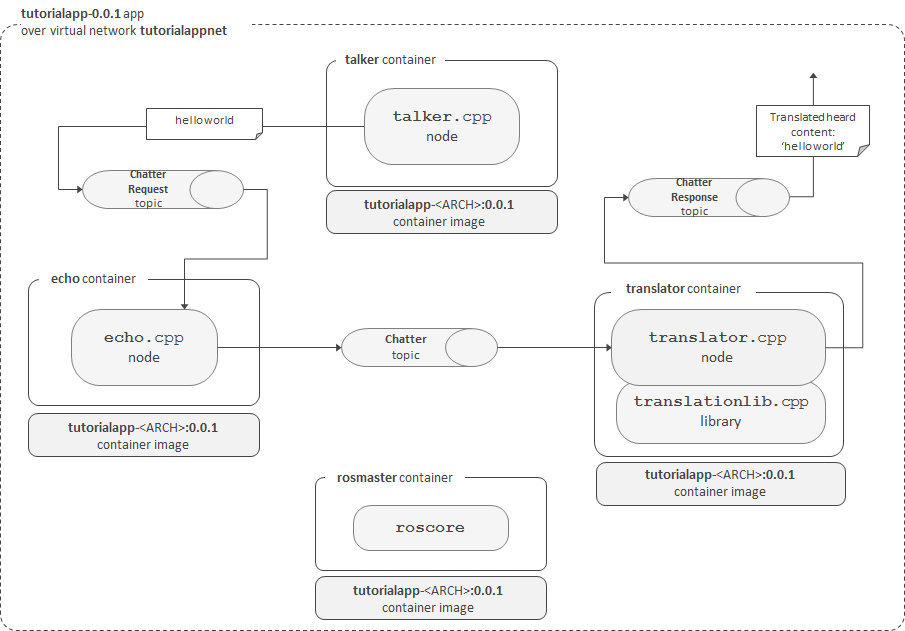

# Tutorial ROS app

This is the repo that contains an example ROS app using `build_with_docker`

It demos following key properties:
> - It consists of some reusable components (linked with git submodules) as well as some application specific ROS packages
> - This repo is a ROS catkin workspace, hence, `src` contains all ROS packages and non-ROS libraries that fulfil this app
> - Automated integration tests with rostest testing framework (based on GTest)
> - Instrumented with [build_with_docker](https://github.com/GERobotics/build_with_docker)

**Architecture** of the app as follows:

## Build

First, clone this repo and all of its submodules

~~~
$ git clone --recursive git@github.com:GERobotics/tutorial_app_ros.git
~~~

This repository has been instrumented with [build_with_docker](https://github.com/GERobotics/build_with_docker)
so building, testing and running can be done with following commands:

API/command | Purpose
---- | -----
make clean      | removes build artifacts and images
make build-image      | creates builder image to build binaries of the project
make build-shell & build-shellenter     | shells into builder image
make build      | builds binaries for specified architecture
make test       | runs unit tests & mocks etc.
make image       | creates runtime image that will be run with `make run` below

## Run

API/command | Purpose
---- | -----
make run       | downloads and launches the app (using Docker Compose)
make pull      | downloads the app without starting an app based on the configuration of `make run` command
make stop      | stops the app that was started by `make run`
make logs      | shows logs of the app that was started by `make run`

## API

This repo exposes following app-specific API:

- [test_app API](src/tutorialapp)
- [appservices API](src/appservices)

